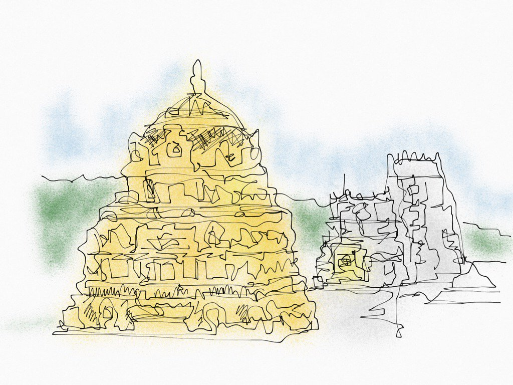

fontsize: 14pt
---

This was the first time I went to Tirupati, the temple town.  

It was 2:30 am, my mother woke me with a cup of coffee. After that we got ready for the
journey in the next two hours. Meanwhile, our grandparents were ready 
before us. My grandfather is well known in the family for his briskness especially to go on a trip like this.  
My mother and grandmother had prepared lunch and breakfast. It was upma for
breakfast and puliogare for lunch.

We left for the bus stand in about 4:45 am, with my father, who dropped us.
The streets were deserted except for some people and cycles roaming on the
road. Stray dogs were howling here and there. But when we reached the
mainroad, there were some trucks and busses moving and honking around.

The bus arrived after 10 minutes, at 4:55.
We boarded the bus by five. I and my sister found our seats in the front
quickly. My mother and grandparents were back of us. 

A lady draped in yellow coloured sari and a little aged, urged my mother move front quickly. Even though
my mother kept on moving and there was no rush, she was pushing hardly against my mother. My mother
could feel some  movment in her handbag. She finally lost her patience and screamed at the lady to go first. The lady left
my mother the way and got down the bus and ran away, which was surprising. My mother settled and
checked her bag. She was right. _The lady had tried to steal stuff from her
bag! Thank goodness, my mother's glasses had protected her things._ In a later
we realized that pack of chocalates were gone.

We were lucky enough to find a seats in the front itself. The bus started in about five minutes.
In the first one hour I was awake in the bus. I looking out of the window, the world was dark blue colour. 
The trees, plants and buildings made dark patches in the dark blue sky. The air was gushing through the windows.
The feelings was so nice. After enjoying this for a while, eventually I fell asleep.

The bus stopped at main stops, like _Mulbagal, Chittor, Kolar, Palmaner._ I
had slept nicely till the bus stopped for a break at Mulbagal. We had our
brakfast there. I did not sleep thereafter.

The sun was a perfect circle and orange in colour. The road was
surrounded with trees and plants on both sides. It was filled with curves and
turns. Now the sky was light blue. 

I was sitting with my grandfather. He was adivising me to observe everything on the road, especially the green boards
with distances for destinations on it. 

We reached at _Tirupati_ at about 10:30. The first place we visited was _Tiruchanur_ the
place where the temple of Lakshmi,  _Sri Venkateshvara Swamy's wife,_ exists. The temple
is named as _Alamelu Mangapuram._ 

The temple had strict rules. For example, you had to leave your electronic
devices and footwares outside the temple. There were many old people selling many things 
cotton candies, toy guns, fruits and sacred items. 

After submitting the footwares and and phones outside the temple, we headed to
the maingate, but that was not an easy job. There were multiple queues leading to
the maingate. They were of three types of them : two special, that is, paid
queues, and a free queue. 

We at first thought that everything were same, but it was not. The guy at the
special queue stopped us and told us to go to the other queue. My grandfather
asked the reason, to that the guy replied that we were supposed to take the
ticket before itself. My grandfather thanked him and told _"Nevermind,"_
and continued moving.

The crowd was irresistable. There were more than 250 people present. The
people had no patience at all. I felt like I was squashed like a fruit between
them.

The queue led us directly from the main entrance, called _gopuram,_ till the
main sacred sanctum. I couldn't even see the goddess properly! I just had a
glance at her. The people behind me didn't give me enough time to properly
look at her.

After seeing the goddess we took a round of the temple. There were many small
reliefs on the walls of the temple, but we had no time to even gaze at them.
There were two reasons  for this, that is,

1. People were rushing and pushing,
	
2. We only had little time to spend there. We had to go the _Tirumala_
	   temple by two.

After collecting our things, we went to the bus stand. 

Now, the temple at Tirupati is divided into two parts : the temple at the base of the
hills, called _Tirupati,_ and the temple up the hills called the _Tirumala_.
Now we were headed to Tirupati.

Lucky us, we got a bus without waiting much. As like the last time, we got seats in the front.
I sat in the single seat next to the driver. I could see both front and in the
sides. The bus travelled for 5 minutes, and then stopped at the checking
station. 

Here they check the whole bus, passengers and their luggages. We got
down the bus and walked to the metal detector. There were two ways. One for
gents and other for ladies. There were men and women before the machines for
checking our body. We had to leave our luggage in the conveyor belt, which led
to the scanner. This made things easy for the people to check!

_What a proper checking system!_

After all that checking, we boarded the bus again. The buss started off. For
the first one kilometre we travelled on road. After that we began climbing the hills.
The roads on the hills was perfectly made. Smooth surface. It was covered with
trees and flowers on both sides. It was filled with steep and deep curves.

After going a little up, the beautiful flowers began to decrease. It began
more and more _mountaneous_. At certain points the trees on the left side of
the bus, where I was sitting, vanished. I couldd see the houses and roads down
below. The houses were like _small boxes made of sand!_ The road was like
_lines made by children with a stick in sand!_ 

Like I said before, The turns and curves were many in number. As the driver drove on these, the bus
was turning and twisting. I felt, at each turn and curve, that the bus was
going to topple off the mountain! The bus travel involved moving around the 7
hills, or _edukondalam_ in telugu. So I could look at the hills we've just
passed, back of us! My mother and sister and me too enjoyed it very much.

After 45 minutes of travel, we landed at the _Tirumala_, the main temple. We
got refreshed there, had our lunch and started off. 

There were  many steps to do before going to the temple. First we ordered a jeep
to leave us at the _special darshan._ It was pre-booked, by my uncle, costing
Rs.300 per head. 

When we reached the checking centre, where they check our
_Aadhars_, our identification numbers, when the guy there informed us that we must
only wear only _veshti_ to the temple, not pants. We were very frustrated. Then I
remembred some people selling _veshtis_ in the front. I had wondered why they
were doing so. Now I got the reason! 

_They had a good  business plan!_

The guy at the checking centre had informed that I too had to wear a veshti. But when we went to buy it, the man who
was selling it, told I needn't.  We were in a dilemma, when we again approached
the checking centre, lucky us, he was busy in some other work. He didn't
notice me wearing a pant. I slipped! 

Next we went to the counters where we should submit our _Aaadhar_, elctronic devices, and footwares.
After submitting those, we went to the metal detectors. My mother had
not submitted the power bank in the earlier counter. So, she had to go back
and submit it, due to this, we wasted precious 10 minutes!

The counters directly led to some passages which led to the main gopuram itself. I
thought that after one passage, we would find ourselves inside the temple. But
I was comletely wrong. One passage led to another identical one. It was
frustratiting in the beginning itself. Even though we were in _special
darshan,_ there was so much crowd in it too! That too on a monday! My mother
informed that we were lucky on that day beacause as the godowns were closed,
much time was saved.

After 5 passages of the same identical looks, we reached the main gopuram. I
thought that it was a good time for us beacause we reached the gopuram in 35
minutes of time. My mother informed that this was good because otherwise we
had to be waiting for like one and a half hour there! After entering into the
temple, the queue again slowed down. 

An uncle, beside me, seemed  have  got thrilled so much.
Suddenly, he screamed, _Govinda! Govinda!_ all the others followed him for
another 5 times. His voice was becoming louder and louder with each call.

After waiting for about 30 minutes, we were left for the shrine. As soon as
the shrine drew nearer, the pushings from the back became more and more
harder.

A lady, in particular nearly pushed me off. I felt very
bad about the people present there. I did not take good look at the god, for the push behind
me was irresistable. My sister being only 6 years old couldn't
see the image of the god properly. So, my mother lifted her up for her to see. 
But the lady at the entrance told that _you must not lift kids up._ 

_What kind of rules **is** that?_

In fact, there were many things around the temple to explore. But the crowd
present was merciless to anyone present there. After seeing the whole temple
and going around it, I felt very uneasy. It was due to the different water and the
crowds. 

